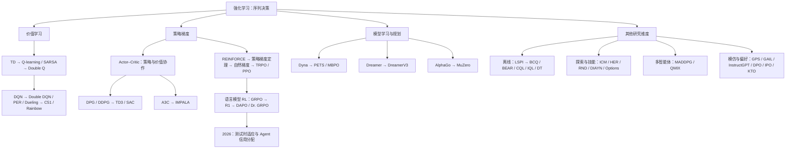

# 强化学习 60 篇论文：从预测、控制到推理与 Agent

强化学习算法看似分支繁多，核心问题却彼此相连：价值如何估计，策略如何更新，经验从哪里来，奖励又如何分配到动作。

本系列以 60 篇代表论文为线索，串联早期控制、深度价值学习、策略梯度、探索与模仿、多智能体、离线学习、世界模型和语言模型强化学习。每篇均可独立阅读，也可以每天一篇，逐步建立知识框架。

**阅读入口**：[强化学习发展时间线总览](00-强化学习发展时间线总览.md)呈现各阶段的问题与方法；下方目录连接逐篇精读，收尾篇提供横向比较和实验设计。

## 每篇文章的阅读结构

1. **一分钟讲明白**：问题、旧方法瓶颈、核心办法、最重要证据和一句话结论。
2. **背景与问题定义**：研究设定、任务意义、观测／动作／奖励／终止、假设。
3. **方法到底改了什么**：继承与新增组件、信息流、公式拆解、教学伪代码、实现陷阱；区分数学目标、算法机制和评估指标。
4. **实验如何验证**：任务、数据、基线、预算、随机性与评价协议；检查额外监督、奖励投机、分布覆盖和公平性。
5. **证据有多强**：逐项解释关键图表或定理的比较、观察、支持范围与不能证明的内容。
6. **贡献与局限**：新意、代价、失败情形、理论前提与复现障碍。
7. **建立理解**：自构例子、五个前置概念、三个后续问题，最后用一张表收束。

各篇从研究问题展开，逐步进入公式、伪代码与证据分析。伪代码强调采样、梯度和更新顺序，具体实现还需结合原论文与代码。

## 全系列架构图

这些维度不是互斥分类。PPO 常与 Critic、GAE 配合；SAC 是无模型 Actor–Critic；Dreamer 同时包含世界模型与 Actor–Critic。DPO 在偏好学习设定下直接优化策略，但不能简单等同于通用在线策略梯度。

## 60 天目录

| 天 | 年份 | 文章 | 核心阅读问题 |
|---|---|---|---|
| 1 | 1983 | [早期 Actor–Critic：让行动者拥有一个评价者](01-actor-critic.md) | 只有失败信号时怎样学会控制 |
| 2 | 1988 | [TD(λ)：结果还没出现，预测为什么就能学习](02-td-lambda.md) | 长序列中的预测与信用分配 |
| 3 | 1990 | [Dyna：一次真实交互，如何产生多次学习](03-dyna.md) | 昂贵交互下的学习与规划 |
| 4 | 1992 | [Q-learning：从一条经验开始，学会比较未来](04-q-learning.md) | 不知道转移概率，为什么仍能逼近最优 Q？ |
| 5 | 1992 | [REINFORCE：环境不可微，也能沿奖励的梯度学习](05-reinforce.md) | 为什么 log 概率乘回报会产生正确方向？ |
| 6 | 1994 | [SARSA：学习实际会执行的行为，而不只学习贪心目标](06-sarsa.md) | 探索中的行为价值应该如何更新 |
| 7 | 1999 | [Options：把“到达门口”也当作一个动作](07-options.md) | 长期任务如何在多个时间尺度决策 |
| 8 | 1999 | [策略梯度定理：Critic 近似到什么程度才不带偏 Actor](08-policy-gradient-theorem.md) | 带函数逼近的策略如何得到可靠梯度 |
| 9 | 2001 | [自然策略梯度：同样改一个参数，行为变化为什么不同](09-natural-policy-gradient.md) | 普通梯度对参数尺度敏感 |
| 10 | 2003 | [LSPI：反复利用同一批数据进行策略迭代](10-lspi.md) | 有限经验下怎样高效评价并改善策略 |
| 11 | 2010 | [Double Q-learning：为什么取最大值会制造乐观偏差](11-double-q.md) | 噪声价值估计中的最大化偏差 |
| 12 | 2013 | [Guided Policy Search：先找到好轨迹，再让策略学会产生它](12-gps.md) | 复杂连续策略如何绕开低质量局部最优 |
| 13 | 2014 | [DPG：沿价值对动作的梯度，训练连续策略](13-dpg.md) | 高维连续动作的策略更新 |
| 14 | 2015 | [TRPO：策略更新太猛，为什么会毁掉好不容易学会的行为](14-trpo.md) | 策略更新的稳定性 |
| 15 | 2015 | [GAE：把一串 TD 误差变成更好用的策略优势](15-gae.md) | 策略梯度的优势估计噪声 |
| 16 | 2015 | [DQN：让 Q-learning 从像素中学习，先要稳住自举目标](16-dqn.md) | 高维图像输入下的动作价值学习 |
| 17 | 2015 | [DDPG：把确定性策略梯度放进深度网络](17-ddpg.md) | 从复杂观测学习连续控制 |
| 18 | 2015 | [Double DQN：不用加一整套网络，也能分开选动作与打分](18-double-dqn.md) | DQN 的价值高估 |
| 19 | 2015 | [优先经验回放：经验并非都值得同样多次重读](19-per.md) | replay中有限梯度预算怎样分配 |
| 20 | 2015 | [Dueling DQN：先判断处境，再判断动作差别](20-dueling-dqn.md) | 许多状态下各动作价值相近 |
| 21 | 2016 | [AlphaGo：策略、价值与树搜索如何分工](21-alphago.md) | 围棋巨大搜索空间中的决策 |
| 22 | 2016 | [A3C：用多个环境的异步经验稳定深度学习](22-a3c.md) | 深度RL的相关样本与训练吞吐 |
| 23 | 2016 | [GAIL：模仿专家的行为分布，而不只复制单步动作](23-gail.md) | 没有奖励函数时怎样学专家行为 |
| 24 | 2017 | [ICM：好奇心奖励应该预测什么](24-icm.md) | 稀疏奖励下的探索 |
| 25 | 2017 | [MADDPG：训练时看全局，执行时各自行动](25-maddpg.md) | 多个学习者使彼此的环境不断变化 |
| 26 | 2017 | [HER：失败轨迹也能成为另一个目标的成功经验](26-her.md) | 目标条件任务中的稀疏成功信号 |
| 27 | 2017 | [PPO：裁剪替代目标到底限制了什么](27-ppo.md) | 在稳定性与实现成本间折中 |
| 28 | 2017 | [C51：不只预测平均回报，还预测回报分布](28-c51.md) | 价值平均数丢失回报分布结构 |
| 29 | 2017 | [Rainbow：六种DQN改进叠加后，哪些真的重要](29-rainbow.md) | 独立DQN改进能否互补 |
| 30 | 2018 | [SAC：随机性进入目标，而不仅是探索噪声](30-sac.md) | 连续控制的探索与样本效率 |
| 31 | 2018 | [TD3：给 DDPG 的价值误差加三道约束](31-td3.md) | Critic 错误被 Actor 放大的不稳定性 |
| 32 | 2018 | [IMPALA：采样与学习分离后，用V-trace处理策略滞后](32-impala.md) | 大规模分布式RL的吞吐与数据滞后 |
| 33 | 2018 | [DIAYN：没有任务奖励，能否先学会一组不同技能](33-diayn.md) | 无外部任务时的技能发现 |
| 34 | 2018 | [QMIX：用单调混合，让局部贪心与团队价值一致](34-qmix.md) | 合作团队的分散动作选择 |
| 35 | 2018 | [PETS：用模型集成表示不确定性，再进行短期规划](35-pets.md) | 模型驱动控制的误差与过度自信 |
| 36 | 2018 | [RND：预测一个冻结随机网络，也能产生探索奖励](36-rnd.md) | 难探索环境中的新颖性估计 |
| 37 | 2018 | [BCQ：离线学习时，先别选择数据从没支持过的动作](37-bcq.md) | 固定数据上的价值外推错误 |
| 38 | 2019 | [BEAR：限制支持范围，而不必复制行为频率](38-bear.md) | 离线Q的自举误差传播 |
| 39 | 2019 | [MBPO：不要在错误模型里想象太久](39-mbpo.md) | 模型偏差与样本效率的权衡 |
| 40 | 2019 | [Dreamer：把策略训练搬到潜在世界里](40-dreamer.md) | 从像素高效学习长期控制 |
| 41 | 2019 | [MuZero：不用重构世界，也能学出供搜索使用的模型](41-muzero.md) | 未知动力学下如何保留树搜索优势 |
| 42 | 2020 | [CQL：不敢相信未知动作，就直接惩罚乐观估值](42-cql.md) | 离线策略利用分布外高Q |
| 43 | 2020 | [AWAC：先用旧数据起步，再顺利接入在线学习](43-awac.md) | 离线预训练到在线微调的衔接 |
| 44 | 2021 | [Decision Transformer：把控制写成条件序列预测](44-decision-transformer.md) | 离线决策是否必须使用Bellman自举 |
| 45 | 2021 | [TD3+BC：离线学习中，一项模仿损失能走多远](45-td3-bc.md) | 离线方法复杂度与复现敏感性 |
| 46 | 2021 | [IQL：不查询数据外动作，也能向更好价值学习](46-iql.md) | 离线价值学习中的OOD动作查询 |
| 47 | 2022 | [InstructGPT：从预测下一个词，到学习人类更偏好的回答](47-instructgpt.md) | 语言模型的输出与用户意图不一致 |
| 48 | 2023 | [DreamerV3：为什么跨任务稳定，比单个任务高分更难](48-dreamerv3.md) | 世界模型算法跨任务的超参数敏感性 |
| 49 | 2023 | [DPO：为什么偏好分类可以直接更新语言模型](49-dpo.md) | RLHF的多模型与在线训练复杂性 |
| 50 | 2023 | [IPO：偏好胜负差距，是否应该被无限拉大](50-ipo.md) | 直接偏好优化的过拟合与假设问题 |
| 51 | 2024 | [KTO：只有“好／不好”标签，如何进行模型对齐](51-kto.md) | 成对偏好数据的采集要求 |
| 52 | 2024 | [DeepSeekMath／GRPO：用同题多回答，替代独立价值基线](52-grpo.md) | 语言模型RL的Critic成本与评价基线 |
| 53 | 2025 | [DeepSeek-R1：区分纯RL探索、完整训练管线与蒸馏](53-r1.md) | 大模型推理行为能否通过强化学习增强 |
| 54 | 2025 | [DAPO：GRPO训练中的采样、长度与裁剪，如何一起修正](54-dapo.md) | 大规模推理RL的熵塌缩、无效样本与长度问题 |
| 55 | 2025 | [Dr. GRPO：两个归一化分母，怎样改变学习方向的权重](55-dr-grpo.md) | GRPO长度与题目难度相关的梯度偏置 |
| 56 | 2026 | [MBDPO：让世界模型、价值学习与扩散策略更一致](56-mbdpo.md) | 模型搜索与价值训练的策略分布不一致 |
| 57 | 2026 | [WorldSample：合成经验什么时候值得交给真实机器人学习](57-worldsample.md) | 真实机器人交互昂贵，合成数据可能污染Critic |
| 58 | 2026 | [FACTOR：先分配动作信用，再决定哪些token承担它](58-factor.md) | 多轮Agent中轨迹、动作和token三层信用混杂 |
| 59 | 2026 | [TTPO：没有标准答案，测试时还能怎样更新模型](59-ttpo.md) | 无标签测试时推理适应 |
| 60 | 2026 | [DRACO：没有成功验证器时，如何把评分准则分配到步骤](60-draco.md) | 多轮工具任务缺少可靠终局成功标签 |

## 收尾与阅读路线

[系列收尾：三个自构实验、三处具体疑点、统一比较与阅读记录](61-系列收尾.md)

按日期通读适合建立历史脉络；需要快速搭建最小基础时，可先走 Q-learning → REINFORCE → DQN → DPG／DDPG → TRPO／GAE／PPO → TD3／SAC，再进入自己的专题。

**进一步阅读的方向**包括约束与安全 RL、风险敏感 RL、部分可观测控制、元强化学习、后悔界、探索复杂度、逆强化学习理论和全部机器人实践。这些专题可以在掌握本系列的基本方法后继续展开。

学习检查：每篇读完，独立画信息流、写一个核心更新、复述一个有条件的证据，并构造一种失败情形。具体评估记录表见收尾篇。

## 选文与证据说明

目录按所选论文首次公开或相应历史版本的年份排列，同年兼顾先修关系。DQN 采用 2015 年 Nature 版本，文内另述 2013 年预印本；BCQ 对应 2018 年预印本与 2019 年会议论文。2026 年专题范围截至 9 月 8 日。

文章分别标明作者主张、论文证据与教学分析。论文成绩引自作者报告，教学手算单独标注；本系列未独立运行原论文训练。理论文章以证明及其前提为主要证据。

[早期 Actor–Critic](01-actor-critic.md)、[SARSA](06-sarsa.md)和 [Options](07-options.md)的原始资料获取受限，具体范围在文首说明。其原实验图表与数值尚未全部可靠核实；各篇的引用版本与阅读范围汇总于[收尾篇](61-系列收尾.md)。
