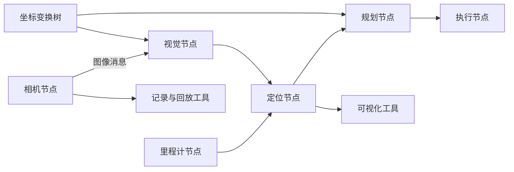

# 058｜ROS：让机器人算法能组成系统

[总览](00-发展时间线总览.md) · [目录](README.md) · [上一篇：iSAM](057-isam.md) · [下一篇：CHOMP](059-chomp.md)

论文：Morgan Quigley 等，*ROS: an open-source Robot Operating System*，ICRA Open-Source Software Workshop，2009。[第一作者保存的六页全文](https://ai.stanford.edu/~mquigley/papers/icra2009-ros.pdf)；[作者发表列表](https://ai.stanford.edu/~mquigley/doku.php?id=papers)。以下阅读范围为原论文全文。这是早期 ROS 的架构文章，既不是 ROS 2 设计论文，也不是某个当前发行版的安装说明。

## 一分钟理解

识别物体、定位机器人、生成路径，各自都有优秀算法。但要让机械臂抓起桌上的杯子，还需要相机驱动、坐标转换、通信、启动、日志和调试。研究者往往不是卡在某一个公式，而是卡在不同模块无法可靠合作。

ROS 提供一层组织方法：把功能分成独立进程，用定义明确的消息连接；把观察、录制、回放和启动也做成通用工具；让算法主体尽量留在独立库里，薄薄一层适配器负责进入机器人系统。

论文的主要证据是架构和使用场景，展示这种设计怎样支持替换模块、复用导航组件、可视化、跨语言协作和坐标变换。它没有用随机对照研究证明开发效率提升了某个百分比，也没有提出新的定位或控制最优性定理。

一句话：在多模块、多语言、多计算机的机器人研发中，通过消息接口、独立节点和可组合工具，降低集成与调试的耦合，代价是通信及协调开销，而且中间件本身不保证算法正确或实时控制稳定。

## 背景：系统复杂度有自己的研究问题

论文源于 STAIR 与 Willow Garage 服务机器人的集成需求。机器人既有底层设备，又有视觉、语音、规划与推理，单一团队难以重写整个软件栈。硬件差异使复用困难，程序互相调用的方式又容易把算法和某个框架绑死。

这里的“状态”不是一个固定的马尔可夫向量，而是各模块维护的内部数据；“输入、输出”表现为消息、服务调用和设备接口。奖励、梯度更新、训练集与测试集都不适用。值得分析的是接口、依赖、通信路径、故障传播和可观察性。

摘要已经限定名称含义：ROS 不替代宿主系统的进程管理与调度，而是在其上提供结构化通信层。把它理解成 Linux 的替代品，会误判其职责；把它理解成自动提供全部机器人智能，也同样不成立。

第 II 节给出五个设计取向：点对点、工具化、多语言、薄层、自由开源。作者也明确不认为存在适合所有机器人软件的唯一框架。它是一组面向集成研究的权衡，而不是普适性能最优解。

## 方法：把连接关系从算法代码里移出来

### 节点、消息、话题与服务

原文把节点定义为执行计算的进程。节点向某个话题发布严格类型化消息，其他节点按话题订阅；一个话题允许多个发布者和订阅者。发布者无需在代码里写死接收者名单。

话题适合持续数据流，例如相机帧、里程计和地图。服务则用请求与响应消息表达一次事务，原文规定同名服务由一个节点提供。持续传感器流和“请做一次计算并返回结果”有不同交互需求，不能只用一个通信原语解释全部系统。

跨语言接口由消息定义生成相应语言的数据结构和序列化代码。第 II-B 节列出当时的 C++、Python、Octave 和 LISP 支持；这是 2009 年状态。语言中立保证的是协议层互操作，不保证浮点约定、物理单位和语义天然一致。

### 点对点与 master 并不矛盾

节点通过名称服务找到彼此，再建立数据连接。master 负责发现，并不要求每条图像或激光数据都先经过它转发。

第 II-A 节的机器人有机载以太网与连接远端计算机的无线网络。如果所有数据都经过位置不合适的中心服务器，本来只需留在一个子网的数据也可能穿越慢链路。点对点连接降低这种多余转发，但实际带宽还取决于订阅数量、复制和传输机制。

因此“数据面不是中心转发”不等于“系统没有中心组件”，更不等于网络分区、发现失败或节点重启会自动无损恢复。

### 薄适配器，让算法库可以独立存在

第 II-D 节建议把驱动和算法尽量写成不依赖 ROS 的库，再用小可执行程序暴露配置与数据接口。这样同一个几何优化器可以被独立测试、被其他程序调用，也可以作为机器人节点运行。

ROS 复用 Player、OpenCV、OpenRAVE 等已有功能。论文的贡献是降低这些组件进入共同系统的阻力，而非把其内部导航、视觉和规划算法重新发明一次。

### 工具也成为系统的一部分

第 IV 节分别讨论单节点调试、日志回放、打包子系统、协同开发、可视化、命名空间和坐标变换。工具能够订阅同样的数据接口，因此记录器和可视化器不必侵入被测算法。

用一幅教学图概括原理：



这不是原文某张实验图的复制，而是组合其接口思想的示例。图上的箭头只表示数据依赖，没有隐含零延迟、线程安全或反馈稳定性的承诺。

```text
启动阶段：
    按配置启动设备、定位、规划与执行等节点
    节点注册发布话题、订阅话题和服务
    经名称发现建立所需数据连接
运行阶段：
    设备节点读取传感器，生成有明确类型的数据消息
    估计节点消费相关观测，发布位姿或地图
    规划节点读取估计及目标，生成动作计划
    执行节点消费计划，调用底层设备接口
调试某一算法：
    记录其输入消息流
    将同一日志回放给算法节点，观察输出与计算用时
    替换该节点，保持其他接口和输入条件一致
```

这是教学系统流程，并非论文提出的数值算法。具体节点还须处理初始化、错误输入与设备状态，不能把这里的简化步骤直接当作实机控制程序。

## 公式在哪里：通信一致性之外，还有几何一致性

原论文没有统一优化损失。为了说明 tf 的数学职责，设 ${}^AT_B(t)$ 把 B 系坐标变换到 A 系，则一个点可通过

$$ {}^Ap(t)={}^AT_B(t)\,{}^BT_C(t)\,{}^Cp(t) $$

从 C 系转到 A 系。这是刚体变换的标准教学表达，不是 ROS 新提出的公式。tf 把这类变换组织成动态树，使不同模块可以查询所需坐标关系。

如果扫描发生在 $t_0$，机械臂在 $t_1$ 已转动，使用 $t_1$ 的外参去解释 $t_0$ 图像会产生几何错误。两个消息的类型完全匹配也阻止不了这个问题。框架提供共享机制，开发者仍必须维护坐标方向、单位与时间含义。

名字空间也只是防止符号冲突。例如两台机器人的定位话题可以分别命名，避免互相覆盖；但这不自动完成两张地图的配准，也不自动成为多机器人协同规划算法。

## 怎样评价一篇没有性能排行榜的系统论文

| 检查项 | 原文提供的内容 | 证据范围 |
|---|---|---|
| 需求来源 | STAIR 与个人服务机器人、多计算机异构网络 | 有具体系统动机，非所有嵌入式设备的代表 |
| 核心机制 | 类型化消息、点对点连接、名称服务、话题和服务 | 可以分析接口如何实现解耦 |
| 使用场景 | 单节点替换、日志回放、导航启动、多实例命名空间 | 展示设计可操作性，非受控开发效率试验 |
| 工具 | roslaunch、rospack、rviz、消息监视与绘图、tf | 属于当时实现描述，不是当前命令兼容性保证 |
| 基线比较 | 对其他框架的设计取向讨论 | 没有统一硬件和工作负载下的延迟、吞吐排行榜 |
| 预算与重复 | 无训练预算；没有给随机种子、重复部署次数或置信区间 | 不适用项无需编造为实验表数字 |
| 任务性能 | 导航等现成功能的组合示意 | 不能把导航成功率归因于中间件单独提升 |

## 五处值得认真看的证据

**图 1 与第 II-A 节：为什么要点对点。** 机载与离机计算通过异构链路连接，说明中心转发可能制造多余流量。这是架构推理和场景说明，不是给出了多少 Mbps 的定量节省。

**第 II-B、II-D 节：复用发生在协议和库边界。** 简短的点云消息定义、多语言代码生成，以及独立库的薄封装说明了具体实现路径。它们支持“有机制实现复用”，不能证明不同团队的组件无需适配即可正确组合。

**第 IV-A、IV-B 节：调试不必重启整台机器人软件。** 可以只替换开发中的节点，也可以把记录的数据接入另一张计算图。作者预期能显著提高研发效率，但没有报告对照组工程师、工时或统计结果。

**第 IV-C、IV-F 节：可组合单位不只是一段代码。** 配置描述可以启动导航子图，再通过名字空间多次实例化。这支持部署结构复用；并不证明运行中的机器人状态可以随进程启动自动恢复。

**第 IV-G 节：tf 统一空间关系。** 例子包括移动机器人倾斜激光扫描、双臂间腕部相机与另一只工具的变换。价值在于让复杂几何关系可以系统查询，正确性仍依赖发布的标定和运动信息。

## 贡献与局限

它把研究算法如何进入大型机器人系统提升为一等问题：模块接口、观察工具和协作边界影响实验能否开展，也影响错误能否被定位。系统论文的价值不应只用一个优化目标衡量。

代价是进程通信、数据复制、异步调度、依赖管理与版本协调。论文承认把功能拆成工具可能损失效率，并认为复杂度管理收益值得这种交换；这是设计判断，不是所有工作负载上的性能定理。

以下是根据架构的分析：记录相同消息流有利于比较感知算法，但对闭环策略不充分。新控制策略会改变未来看到的数据，固定日志无法重现这种反作用；回放相同内容也未必重现多线程调度。ROS 让复现更方便，不等于使实验天然确定。

本文也没有给出硬实时截止期证明。命令及时到达、底层控制回路稳定、通信异常时采取何种动作，是具体系统设计必须另行解决的问题。早期 ROS 的设计不能直接代表 ROS 2 在中间件、发现和服务质量方面的安排。

## 一个具体小例子

以下为教学构造。视觉节点输出“杯子中心为 $(0.2,0.1,0.5)$”，规划节点期待机器人基座坐标。如果视觉输出实际上属于相机坐标，三个浮点数依然可以成功传输，但机械臂会走错位置。

改进不是把浮点数换成另一个网络协议，而是明确参考坐标、采集时刻，并通过标定链转换。之后再用同一图像日志替换两个视觉算法，比较它们在相同观测下的误差；要比较抓取闭环成功率，还需重新执行或使用能反映动作反馈的仿真。

五个前置概念：**进程间通信**让独立程序交换数据；**发布订阅**按话题解耦生产者和消费者；**序列化**把类型化数据转成可传输表达；**命名空间**隔离不同实例的名字；**坐标变换树**组织各参考系之间随时间变化的几何关系。

| 原有问题 | 作者的改动 | 为什么可能有效 | 证据 | 代价与局限 |
|---|---|---|---|---|
| 模块互相写死依赖 | 类型消息、话题和服务 | 运行时建立连接，便于替换实现 | 第 III、IV-A 节 | 语义和时间约定仍须一致 |
| 算法与框架深度绑定 | 独立库加薄适配器 | 可以单独测试并跨项目复用 | 第 II-D 节 | 并非所有既有代码都容易解耦 |
| 全系统难观察和重现 | 通用日志、回放、可视化工具 | 复用相同消息接口采集证据 | 第 IV-B、IV-E 节 | 固定日志不等于闭环复现 |

## 自测与参考答案

### 1．ROS 有 master，为什么论文仍称其为点对点？

**答：** 名称发现与业务数据传输是不同职责。master 帮节点找到彼此，数据连接可以直接建立在节点之间，不需要让每条传感器消息绕过中心服务器。因此可以同时存在中心发现组件与点对点数据面；这不构成“完全去中心化”的保证。

### 2．消息字段和类型完全一致，两个组件是否就能安全互换？

**答：** 不能。还要一致理解单位、坐标系、时间、无效值、频率和状态语义。例如相机坐标与基座坐标都能表示成三个浮点数。接口类型解决结构兼容，物理含义和运行约束要由系统契约及验证补足。

### 3．用同一日志比较两个导航策略，可以证明哪个实机到达率更高吗？

**答：** 通常不能。日志可以比较感知或某些离线计算环节，但导航动作会改变后续位置、观测和碰撞风险。固定日志不能模拟这些闭环因果关系。要评价到达率，需要真实执行或具有相应动力学和感知反馈的仿真，再保持目标、环境与预算可比。
